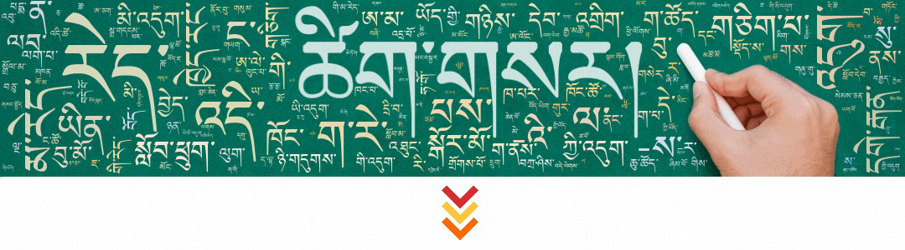

# trinpa
Wordcloud generator for Tibetan

## usage

```python
from trinpa import gen_word_cloud

text = 'space_segmented_text.txt'
out_file = 'wordcloud.png'
mask_file = 'colored_mask_file.png'
background = 'background.jpeg'
# without background:
gen_word_cloud(text, out_file, mask_file)
# with background:
gen_word_cloud(text, out_file, background_file=background)
```

## Output

### Background:


### Mask:


### Wordcloud:



### With Background:

